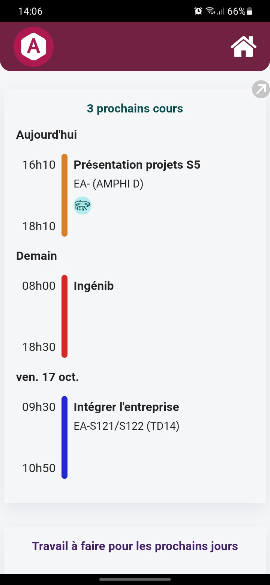
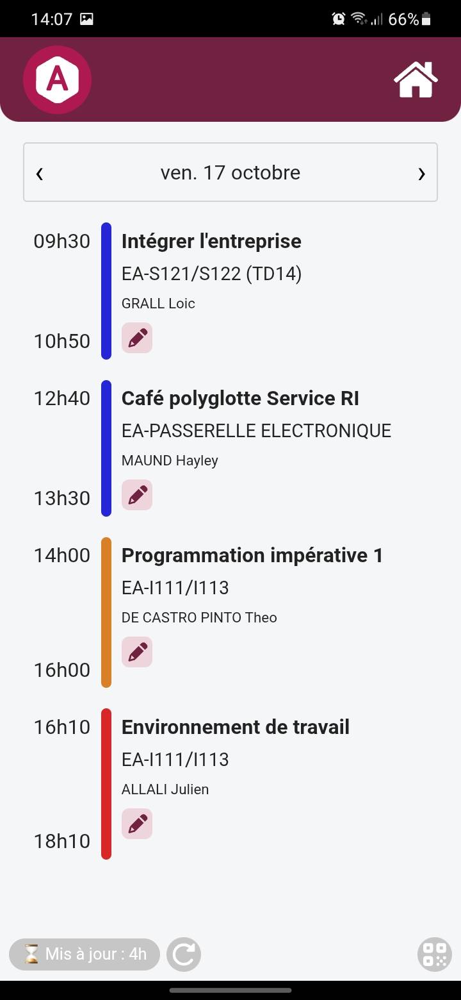
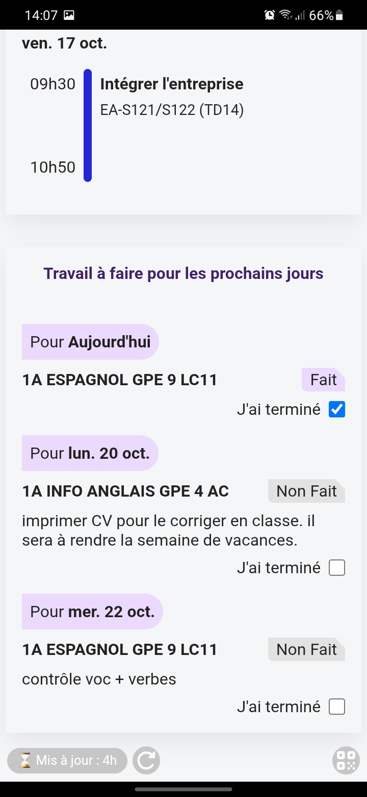
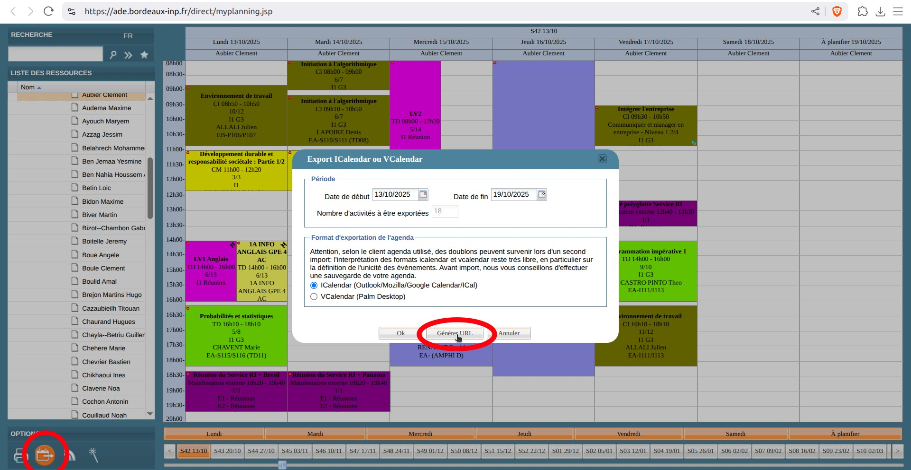

# 📅 ADE Viewer

**Une app Android simple et rapide pour consulter ton emploi du temps ADE**

<p>
  
  
  
</p>

---


## 🚀 Fonctionnalités

- 🔄 Synchronise ton emploi du temps avec ADE
- 🔍 Consulte rapidement les prochains cours à venir
- 📆 Navigation jour par jour
- 🎯 Crée des tâches associées aux cours
- 📲 Installation facile (fichier APK dispo dans les [releases](#-téléchargement))
- 🧑‍💻 Code open source, contributions bienvenues !

---

## 📦 Téléchargement

1. 📲 Télécharge la dernière version stable ici : [⬇️ Releases GitHub](https://github.com/<ton-utilisateur>/<repo>/releases)
2. 🔐 Active l'installation d'apps de sources inconnues sur ton téléphone
3. 📥 Installe l’APK
4. ✅ Ouvre l'app, et entre le lien de ton emploi du temps généré via la page ADE



---

## 🛠️ Installation développeur

Tu veux contribuer, forker, tester en local ou builder l’app ? Tu es au bon endroit.

### ✅ Prérequis

- Git
- Docker (obligatoire)
- Android avec debug USB activé (si tu veux tester sur ton téléphone)

---

### ⚙️ Mise en place

```bash
# 1. Construire l'image Docker
cd docker
docker build -t cordova-dev -f Dockerfile .
cd ..

# 2. Lancer l’environnement de dev Cordova
docker run -it --rm \
    --device /dev/bus/usb \
    -v "$(pwd):/app" \
    -v "$(pwd)/.gradle-cache:/opt/gradle-8.7" \
    -p 8000:8000 cordova-dev \
    bash -c 'cd /app && bash'

# 3. Dans le conteneur, lance l’app dans le navigateur
cordova platform add browser
cordova run browser
```

### 📱 Tester sur ton téléphone

```bash
cordova platform add android
cordova run android --device
```

### 🔐 Build release Android


```bash
docker run --rm -it \
  -v "$(pwd):/app" \
  -v "$(pwd)/.gradle-cache:/opt/gradle-8.7" \
  -e ALIAS_NAME='adeviewer' \
  -e KEYSTORE_PASS='<passwd>' \
  -e KEY_PASS='<passwd>' \
  cordova-dev \
  bash -c '/app/docker/build_release.sh'
```

=> Pour build une release, tu dois renseigner un keystore.

### 🧪 Outils de debug

Installer une apk en filaire :
```bash
adb install -r platforms/android/app/build/outputs/apk/debug/app-debug.apk
```

Consulter les logs ADB :
```bash
adb logcat | grep "ADE"
```
 
Consulter les logs JS :

Sur PC, ouvrir `chrome://inspect`, sélectionner l'appareil filaire connecté. l'app doit être en cours d'exécution.


## 🧩 TODO & Bugs

- ajouter un widget montrant le prochain cours

## 👤 Auteur

- Auteur : Clément
- Dernière modification : oct 2025
- Version : 1.0
- Technos : CordovaJS + Node
- Dépôt Git: https://github.com/Hellolife2750/ade-viewer
